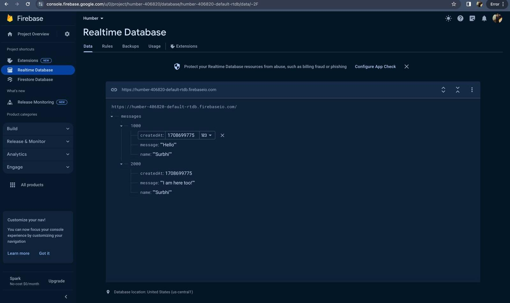

# Firebase-test
A code of html and js contains database through realtime-database(firebase platform). A code to fetch the data from firebase database to the live server through realtime-database.

Link of firebase platform - https://console.firebase.google.com/u/0/project/humber-406820/database/humber-406820-default-rtdb/data/~2F

Project Name on Firebase - Humber

Snapshot of Realtime Database - 